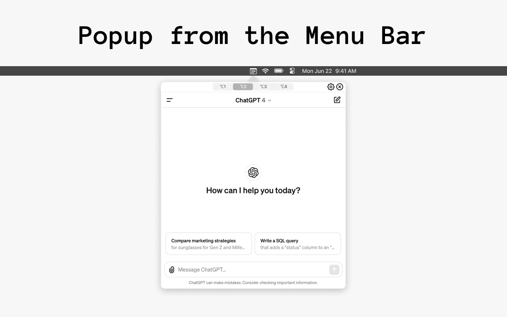

# PopApp

> Access your favorite websites through a convenient popup



---

## Description

PopApp lets you instantly access and switch between up to four favorite websites in a resizable popup from your macOS menu bar, using customizable shortcuts for a seamless experience.

## Requirements

* macOS 13.3 or later
* Xcode 14 or later (for building from source)
* Swift 5.7+

---

## Installation

1. **Clone the repository**

   ```bash
   git clone https://github.com/your-username/PopApp.git
   cd PopApp
   ```

2. **Open in Xcode**

   ```bash
   open PopApp.xcodeproj
   ```

3. **Build & Run**
   Select the “PopApp” scheme and click **Run** (⌘R).

---

## Usage

1. Launch **PopApp**—it will appear in your menu bar.
2. Press the default shortcut (e.g., ⌃⌥Space) to open the pop-up.
3. Use the number keys (1–4) or your own shortcuts to switch between your tabs.
4. Press Esc or click outside the window to dismiss.

---

## Configuration

* Open **Preferences** from the PopApp menu bar icon.
* Under **Tabs**, enter the URLs for your four favorite sites.
* In **Shortcuts**, customize the global hotkey and per-tab keybindings.
* Resize the pop-up by dragging its edges; your layout will be remembered.

---

## License

This project is licensed under the MIT License. See the [LICENSE](LICENSE) file for details.

---

Website: [https://sites.google.com/view/popapp](https://sites.google.com/view/popapp)
App Store [https://apps.apple.com/de/app/the-popapp/id6477869389?l=en-GB](https://apps.apple.com/de/app/the-popapp/id6477869389?l=en-GB)

---
